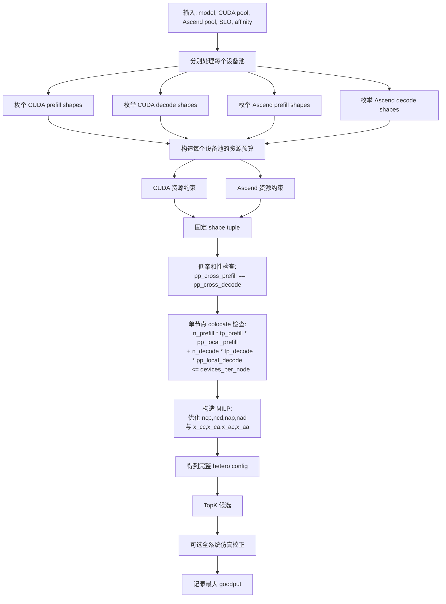

# 异构 DistServe 搜索设计

本文档描述一个面向 CUDA GPU 与 Ascend NPU 混合集群的 DistServe 搜索算法设计。目标是在给定硬件资源、节点亲和性、模型与 SLO 约束时，搜索能够最大化 goodput 的 prefill/decode 资源划分与并行配置。

这里的 goodput 沿用 DistServe 论文语义：系统在满足请求级 SLO attainment 约束时可以承载的最大请求到达率。SLO 由 prefill/TTFT 与 decode/TPOT 两部分组成。

## 设计原则

异构版保留 DistServe 的核心 insight：

1. KV cache transfer 只发生在 prefill instance 与 decode instance 的对应 layer/stage 之间。在低节点亲和性的场景下，应把对应 prefill segment 与 decode segment 共置在同一节点内，使 KV transfer 尽量只走节点内高速互联。因此，低节点亲和性下应强制 prefill 与 decode 的跨节点 stage 划分一致。

2. 目前不考虑将一个prefill instance / decode instance跨CUDA和Ascend放置。

## 输入

搜索器接收两个设备池：

```python
DevicePool(
    kind="cuda",
    num_nodes=num_cuda_nodes,
    devices_per_node=num_gpus_per_cuda_node,
    high_affinity=cuda_high_affinity,
)

DevicePool(
    kind="ascend",
    num_nodes=num_ascend_nodes,
    devices_per_node=num_npus_per_ascend_node,
    high_affinity=ascend_high_affinity,
)
```

还需要以下输入：

```text
model
prefill_slo_ms
decode_slo_ms
prefill_attainment
decode_attainment
cross-pool handoff parameters
profile data for CUDA and Ascend
```

cross-pool handoff parameters至少包含两个方向的参数信息：

```text
cuda -> ascend
ascend -> cuda
```

每一项包含：

```text
fixed_delay_ms
delay_per_token_ms
handoff_goodput_upper_bound
```

## 搜索变量

异构 DistServe 的搜索变量必须区分 device 与 role。role 指 prefill 或 decode。

每个 device-role group 的配置为：

```python
RoleConfig(
    device="cuda" | "ascend",
    role="prefill" | "decode",
    num_instances=int,
    tp=int,
    pp_local=int,
    pp_cross=int,
)
```

完整配置为：

```python
HeteroConfig(
    cuda_prefill=RoleConfig(...),
    cuda_decode=RoleConfig(...),
    ascend_prefill=RoleConfig(...),
    ascend_decode=RoleConfig(...),
)
```

其中四个 role-specific 并行度分别是：

```text
cuda_prefill_tp
cuda_prefill_pp_local
cuda_decode_tp
cuda_decode_pp_local

ascend_prefill_tp
ascend_prefill_pp_local
ascend_decode_tp
ascend_decode_pp_local
```

也就是说，搜索空间允许：

```text
prefill_tp != decode_tp
prefill_pp_local != decode_pp_local
cuda_* != ascend_*
```

但在低亲和性下不允许同一设备池内：

```text
pp_cross_prefill != pp_cross_decode
```

## 物理量与 Goodput 模型

这一节统一定义当前算法中的物理量。

### Instance shape

`shape` 描述一个 prefill 或 decode instance 的并行形状：

```text
shape = (device, role, tp, pp_local, pp_cross)
```

其中：

```text
device ∈ {cuda, ascend}
role ∈ {prefill, decode}
total_pp = pp_local * pp_cross
```

当前约束：

```text
一个 instance 内部不能同时使用 CUDA 和 Ascend。
```

### Single-instance goodput

`mu` 表示单个 instance 在目标 SLO 下能到达的最大请求率。

```text
mu_cp: 一个 CUDA prefill instance 的 prefill goodput
mu_cd: 一个 CUDA decode instance 的 decode goodput
mu_ap: 一个 Ascend prefill instance 的 prefill goodput
mu_ad: 一个 Ascend decode instance 的 decode goodput
```

单位是：

```text
requests / second
```

注意：`mu_*` 不是理论 FLOPS，也不是链路带宽；它是通过单 instance 运行 workload 并满足 SLO attainment 后得到的最大可承载请求速率，也就是该 shape 的 single-instance goodput。

### Instance count

`n` 表示每类 instance 的数量：

```text
ncp: CUDA prefill instances 数
ncd: CUDA decode instances 数
nap: Ascend prefill instances 数
nad: Ascend decode instances 数
```

这些是搜索变量。固定 shapes 后，算法需要决定这四类 instances 各放多少个。

### Resource footprint

`a` 表示一个 instance 的资源占用：

```text
a_cp: 一个 CUDA prefill instance 占用的 CUDA 设备数
a_cd: 一个 CUDA decode instance 占用的 CUDA 设备数
a_ap: 一个 Ascend prefill instance 占用的 Ascend 设备数
a_ad: 一个 Ascend decode instance 占用的 Ascend 设备数
```

高亲和性下把设备池视为大资源池，有：

```text
a = tp * pp_local * pp_cross
```

低亲和性下要求对应 stage colocate，则还要检查 node-local footprint：

```text
local_footprint = tp * pp_local
```

并要求同一 stage 内 prefill/decode 的本地 footprint 之和不超过单节点设备数。

设备池预算记为：

```text
B_cuda: CUDA 设备池总设备数
B_asc: Ascend 设备池总设备数
```

因此资源约束为：

```text
a_cp * ncp + a_cd * ncd <= B_cuda
a_ap * nap + a_ad * nad <= B_asc
```

### Compute goodput aggregation

固定 instance 数后，总 prefill goodput 为：

```text
Lambda_prefill = mu_cp * ncp + mu_ap * nap
```

总 decode goodput 为：

```text
Lambda_decode = mu_cd * ncd + mu_ad * nad
```

### Cross-pool flow variables

允许跨 CUDA/Ascend handoff的情况下，需要描述 prefill 侧流量如何分配到 decode 侧。定义：

```text
x_cc: CUDA prefill  -> CUDA decode 这种方案下满足SLO约束的最大请求速率
x_ca: CUDA prefill  -> Ascend decode 这种方案下满足SLO约束的最大请求速率
x_ac: Ascend prefill -> CUDA decode 这种方案下满足SLO约束的最大请求速率
x_aa: Ascend prefill -> Ascend decode 这种方案下满足SLO约束的最大请求速率
```

单位是：

```text
requests / second
```

这些不是 profile 出来的物理常数，而是给定 shapes 后由算法求出的流量分配变量。

flow 变量必须不大于 prefill 侧满足SLO约束下的goodput（在这里我们假设n个instance能达到的goodput是单个instance能达到的goodput的n倍：

```text
x_cc + x_ca <= mu_cp * ncp
x_ac + x_aa <= mu_ap * nap
```

也必须满足 decode 侧 满足SLO约束下的goodput（在这里我们假设n个instance能达到的goodput是单个instance能达到的goodput的n倍：

```text
x_cc + x_ac <= mu_cd * ncd
x_ca + x_aa <= mu_ad * nad
```

整机 goodput 为：

```text
Lambda = x_cc + x_ca + x_ac + x_aa
```

### Cross-pool handoff goodput upper bound

为了更准确反映不同 prefill/decode shape 组合的 handoff payload 差异，跨池 handoff 上限不再视为纯全局常数，而是升级为 shape-pair-specific：

```text
H_ca(p_cuda, d_asc): CUDA prefill shape p_cuda -> Ascend decode shape d_asc
                      的最大跨池 handoff goodput 上限
H_ac(p_asc, d_cuda): Ascend prefill shape p_asc -> CUDA decode shape d_cuda
                      的最大跨池 handoff goodput 上限
```

单位是：

```text
requests / second
```

因此跨池 flow 需要满足：

```text
x_ca <= H_ca(p_cuda, d_asc)
x_ac <= H_ac(p_asc, d_cuda)
```

默认不加入：

```text
x_cc <= H_cc
x_aa <= H_aa
```

原因是同池 prefill/decode 传输走的都是NVLink等高速线路，传输时间能够忽略，或者说H_cc和H_aa可以是+inf。

这里需要额外说明：`H_ca/H_ac` 不是端到端系统 goodput，而是 handoff 这一阶段在对应 shape pair 下可支撑的最大请求速率上限。它们只刻画跨池传输瓶颈，不直接代表完整请求经过 prefill 和 decode 后的最终 goodput。

### Goodput estimation with cross-pool handoff

当前主线算法不再显式枚举 `ncp/ncd/nap/nad`。给定一个固定的 shape tuple 后，算法直接把四类 instance 数与四个跨池 flow 变量一起放入一个小规模 MILP 中求解。

也就是说，搜索流程保留 shape 枚举，但把 count allocation 交给优化器：

```text
枚举 p_c, d_c, p_a, d_a
    -> 通过 MILP 优化 ncp, ncd, nap, nad 与 x_cc, x_ca, x_ac, x_aa
```

这样可以避免固定 shape tuple 下的四重 count 暴力枚举。若要求 instance 数为整数，则得到 MILP；若先放松为连续变量，则得到 LP，再做邻域整数化。V1 推荐直接使用 MILP，因为变量数量很小。

完整的 MILP 形式为：

```text
maximize Lambda

subject to:
    Lambda = x_cc + x_ca + x_ac + x_aa

    x_cc + x_ca <= mu_cp * ncp
    x_ac + x_aa <= mu_ap * nap

    x_cc + x_ac <= mu_cd * ncd
    x_ca + x_aa <= mu_ad * nad

    x_ca <= H_ca(p_c, d_a)
    x_ac <= H_ac(p_a, d_c)

    a_cp * ncp + a_cd * ncd <= B_cuda
    a_ap * nap + a_ad * nad <= B_asc

    ncp + nap >= 1
    ncd + nad >= 1

    ncp, ncd, nap, nad ∈ Z_{\ge 0}
    x_cc, x_ca, x_ac, x_aa >= 0
```

其中：

```text
p_c: CUDA prefill shape
d_c: CUDA decode shape
p_a: Ascend prefill shape
d_a: Ascend decode shape
```

如果某个 shape 为 `None`，则对应的 instance 数固定为 `0`，对应的 `mu` 与资源占用也视为 `0`。

如果不允许跨池 handoff，可令：

```text
H_ca(p_c, d_a) = 0
H_ac(p_a, d_c) = 0
```

如果跨池 handoff 足够强，可令：

```text
H_ca(p_c, d_a) = +inf
H_ac(p_a, d_c) = +inf
```

此时模型退化为：

```text
Lambda_est = min(Lambda_prefill, Lambda_decode)
```

但即使在不允许跨池 handoff 的情况下，`ncp/ncd/nap/nad` 也仍然通过 allocation solver 求解，而不是暴力枚举。

## PP 语义

每个 role 的总 pipeline parallelism 为：

```text
total_pp_role = pp_cross * pp_local_role
```

在低节点亲和性下：

```text
total_pp_prefill = pp_cross * pp_local_prefill
total_pp_decode  = pp_cross * pp_local_decode
```

其中 `pp_cross` 是 prefill/decode 共享的跨节点 stage 数。

`pp_local_prefill` 和 `pp_local_decode` 可以不同，因为它们描述的是每个跨节点 segment 内部的本地 PP。只要跨节点 segment 对齐，prefill 与 decode 在节点内可以使用不同的本地 pipeline 深度和 TP 配置。

## 资源约束

对每个设备池分别检查资源。

CUDA 资源约束：

```text
cuda_used =
    cuda_prefill.num_instances
  * cuda_prefill.tp
  * cuda_prefill.pp_local
  * cuda_prefill.pp_cross
+
    cuda_decode.num_instances
  * cuda_decode.tp
  * cuda_decode.pp_local
  * cuda_decode.pp_cross

cuda_used <= num_cuda_nodes * num_gpus_per_cuda_node
```

Ascend 资源约束：

```text
ascend_used =
    ascend_prefill.num_instances
  * ascend_prefill.tp
  * ascend_prefill.pp_local
  * ascend_prefill.pp_cross
+
    ascend_decode.num_instances
  * ascend_decode.tp
  * ascend_decode.pp_local
  * ascend_decode.pp_cross

ascend_used <= num_ascend_nodes * num_npus_per_ascend_node
```

## 低节点亲和性约束

对于任意设备池，如果 `high_affinity=False`，则该设备池内应满足：

```text
pp_cross_prefill = pp_cross_decode = pp_cross
```

并且每个 cross segment 的本地资源必须放得进单节点：

```text
prefill_tp * prefill_pp_local + decode_tp * decode_pp_local <= devices_per_node
```

这个约束表示同一个跨节点 stage 内，prefill segment 与 decode segment 被共置在一个节点中。这样对应 stage 的 KV handoff 可以走节点内互联。

如果一个节点内有多个 prefill/decode instance，则每个 stage segment 的 node-local footprint 为：

```text
num_prefill_instances_per_stage * prefill_tp * prefill_pp_local
+ num_decode_instances_per_stage * decode_tp * decode_pp_local
<= devices_per_node
```

## 高节点亲和性约束

对于 `high_affinity=True` 的设备池，可以把该设备池视为一个统一大池：

```text
tp * pp_local * pp_cross <= total_devices
```

工程上建议 V1 仍然使用：

```text
pp_cross = 1
```

也就是把跨节点限制折叠掉，直接枚举较大的 `pp_local`。这样和当前同构搜索逻辑一致，也能减少无意义的 stage mapping 复杂度。

## 模型并行合法性约束

对任意 role config，需要满足：

```text
tp divides num_attention_heads
total_pp = pp_cross * pp_local divides num_layers
model is runnable under (device, role, tp, total_pp)
```

当前代码中同构版通过 `get_model_possible_tp` 和 `get_model_possible_pp` 做类似检查。异构版需要扩展为 device-aware：

```python
get_model_possible_tp(model, device)
get_model_possible_pp(model, device)
is_model_runnable(model, device, tp, pp)
get_max_num_tokens(model, device, tp, pp)
```

`get_model_possible_tp`函数还应该考虑到目前time_estimator中能计算得到的数据里面的tp。

## 时间模型

当前 worker 调用：

```python
get_prefill_time(..., model_type, TP, pp, engine_type)
get_decode_time(..., model_type, TP, pp, engine_type)
```

异构版需要把 profile key 扩展为：

```text
(device, engine_type, model, role, tp, total_pp)
```

即：

```python
get_prefill_time(
    ...,
    device_type="cuda" | "ascend",
    model_type=model,
    TP=prefill_tp,
    pp=total_pp_prefill,
)

get_decode_time(
    ...,
    device_type="cuda" | "ascend",
    model_type=model,
    TP=decode_tp,
    pp=total_pp_decode,
)
```

注意：如果 `prefill_tp != decode_tp`，KV cache 的 layout 可能不同。可以先把这部分成本并入 handoff delay；更严谨的版本应单独建模 layout transform。

## Handoff 模型

请求完成 prefill 后，需要选择 decode group。跨池 handoff delay 由 prefill device 与 decode device 决定：

```text
delay_ca = fixed_delay_ca + delay_per_token_ca * current_context_len
delay_ac = fixed_delay_ac + delay_per_token_ac * current_context_len
```

跨池 handoff 还可以有独立容量上限：

```text
H_ca(p_cuda, d_asc): cuda prefill shape p_cuda -> ascend decode shape d_asc
H_ac(p_asc, d_cuda): ascend prefill shape p_asc -> cuda decode shape d_cuda
```

这里需要强调：当存在多个 request 同时需要跨池 handoff 时，V1 不应将其理解为“严格串行”，也不应将其理解为“彼此完全独立的无限并行”。

当前文档采用的语义是：

```text
多个 handoff request 可以并发发起，
但它们共享有限的跨池 handoff 资源与链路 goodput 预算
```

因此：

1. 对单个 request 而言，handoff 代价由 `delay_ca/delay_ac` 描述。
2. 对多个 request 同时存在的情形，跨池总吞吐由对应 shape-pair 的 `H_ca/H_ac` 描述。

换言之，`delay_*` 与 `H_*` 分别对应：

```text
delay_* : per-request handoff latency surrogate
H_*     : handoff goodput upper bound for a shape pair
```

因此当前模型的默认解释是：

```text
x_ca <= H_ca(p_cuda, d_asc)
x_ac <= H_ac(p_asc, d_cuda)
```

表示该方向上所有并发 handoff request 的总速率不能超过该方向的有效 handoff goodput 上限。

从系统实现角度看，这更接近“共享有限 goodput 预算的并发传输”：

```text
multiple handoff requests
    -> queue / overlap in time
    -> compete for shared transport budget
    -> become decode-ready
```

这也是为什么在建模中既需要：

```text
delay_ca, delay_ac
```

又需要：

```text
H_ca, H_ac
```

前者刻画单请求的 handoff 额外时延，后者刻画对应 shape pair 下多请求并发时的 handoff goodput 上限。二者不能互相替代。

低节点亲和性下，如果 prefill 与 decode 位于同一 device pool 且 `pp_cross` 对齐，则对应 stage 的 handoff 可以视为 node-local，其影响默认已经反映在单 instance 的 prefill/decode goodput profiling 中。否则如果请求跨 CUDA/Ascend pool，则必须走跨池 handoff 模型。

V1 建议：

1. 同一设备池、低亲和性、stage 对齐：不额外引入 `H_cc/H_aa`，避免与 `mu_*` 重复计数。
2. 同一设备池、高亲和性：同样优先由 single-instance goodput 吸收本地 handoff 影响。
3. CUDA/Ascend 跨设备：显式建模 `delay_ca/delay_ac` 与 shape-pair-specific `H_ca/H_ac`。
4. 只有当同池 handoff 被实验证明确认为独立瓶颈时，才加入 `H_cc/H_aa`。

### Cross-pool bandwidth measurement

为了给 `H_ca/H_ac` 提供实测依据，当前实现增加了一个 `iperf3` 测试脚本：

[`measure_iperf3_bandwidth.py`](/users/rh/DistServe/simdistserve/benchmarks/measure_iperf3_bandwidth.py)

该脚本运行在 `iperf3` client 侧，自动对不同方向和不同并发流数 `P` 做 sweep，并写出：

```text
runs.csv
summary.csv
summary.json
raw/*.json
```

其中：

1. `runs.csv` 记录每一次原始实验。
2. `summary.csv` 按 `(direction, P)` 聚合。
3. `summary.json` 保存元数据和聚合结果。

本次实验结果位于：

[`20260423T090835Z`](/users/rh/DistServe/simdistserve/benchmarks/results/network/iperf3/20260423T090835Z)

实验拓扑如下：

```text
client_bind_ip = 10.0.3.138
server_ip      = 10.129.165.27
duration       = 30 s
repeats        = 3
P              ∈ {1, 2, 4, 8, 16}
```

方向定义为：

```text
forward = client -> server = 10.0.3.138 -> 10.129.165.27
reverse = server -> client = 10.129.165.27 -> 10.0.3.138
```

在当前实验语义下，可将其解释为：

```text
forward ≈ Ascend -> CUDA
reverse ≈ CUDA -> Ascend
```

聚合后的 `summary.csv` 如下：

| direction | transfer_direction | P | repeats | mean receiver Mbps | std Mbps | mean retransmits |
|---|---|---:|---:|---:|---:|---:|
| forward | client_to_server | 1 | 3 | 767.10 | 39.61 | 447.00 |
| forward | client_to_server | 2 | 3 | 795.65 | 34.60 | 1096.33 |
| forward | client_to_server | 4 | 3 | 814.76 | 3.65 | 3554.67 |
| forward | client_to_server | 8 | 3 | 812.26 | 2.21 | 12447.67 |
| forward | client_to_server | 16 | 3 | 812.88 | 3.05 | 35306.33 |
| reverse | server_to_client | 1 | 3 | 787.63 | 8.82 | 625.33 |
| reverse | server_to_client | 2 | 3 | 771.37 | 5.68 | 904.67 |
| reverse | server_to_client | 4 | 3 | 704.44 | 3.15 | 1481.00 |
| reverse | server_to_client | 8 | 3 | 611.31 | 25.34 | 2480.00 |
| reverse | server_to_client | 16 | 3 | 566.66 | 19.91 | 3428.33 |

这里的 `mean receiver Mbps` 定义为：

```text
对固定 (direction, P)，将 3 次重复实验的 receiver_bits_per_second 做算术平均，
再除以 10^6
```

经验结论如下：

1. `forward` 方向在 `P = 4` 左右已经达到平台，继续增大 `P` 几乎没有收益，但重传迅速升高。
2. `reverse` 方向不是平台型，而是在 `P = 1` 取得最高有效带宽；增大 `P` 会导致带宽持续下降。
3. 因此，跨池 handoff 带宽不应简单取某个固定 `P` 下的最大值，而应取“达到平台且重传不过度恶化”的工作点。

据此，当前文档建议将 `B_ac/B_ca` 视为链路级测量值，而 `H_ac/H_ca` 则进一步按 shape pair 细化。

当前实验给出的链路级有效单向带宽可写为：

```text
B_ac = 814.76 Mbits/s = 101.85 MB/s    # Ascend -> CUDA, 取 forward P=4
B_ca = 787.63 Mbits/s =  98.45 MB/s    # CUDA   -> Ascend, 取 reverse P=1
```

若希望对 `CUDA -> Ascend` 更保守一些，也可改为：

```text
B_ca = 771.37 Mbits/s = 96.42 MB/s     # reverse P=2
```

更严谨的 shape-pair-specific 建模为：

```text
H_ca(p_cuda, d_asc) = B_ca / E_r[S_ca(r | p_cuda, d_asc)]
H_ac(p_asc, d_cuda) = B_ac / E_r[S_ac(r | p_asc, d_cuda)]
```

其中：

```text
S_ca(r | p_cuda, d_asc): 一条请求从 CUDA prefill shape p_cuda
                         handoff 到 Ascend decode shape d_asc 时的 payload bytes
S_ac(r | p_asc, d_cuda): 一条请求从 Ascend prefill shape p_asc
                         handoff 到 CUDA decode shape d_cuda 时的 payload bytes
```

这里的单请求 payload 建议按下式构造：

```text
S_dir(r | shape_pair)
= N_handoff_tokens(r) * bytes_per_token_dir(shape_pair)
```

在当前 V1 语义下，可近似取：

```text
N_handoff_tokens(r) ≈ prompt_len(r)
```

而：

```text
bytes_per_token_dir(shape_pair)
```

应由模型结构、`TP`、`PP`、stage 划分、dtype 以及是否存在 layout transform 共同决定。

因此，对搜索器而言，不建议使用单一全局 `S_ca/S_ac`，而应对每一个跨池 shape pair 分别计算：

```text
E_r[S_ca(r | p_cuda, d_asc)]
E_r[S_ac(r | p_asc, d_cuda)]
```

例如，当某个 shape pair 下平均 handoff payload 为 `8 MB/request` 时：

```text
H_ac(p_asc, d_cuda) ≈ 101.85 / 8 = 12.73 requests/s
H_ca(p_cuda, d_asc) ≈  98.45 / 8 = 12.31 requests/s
```

当另一个 shape pair 下平均 handoff payload 为 `16 MB/request` 时：

```text
H_ac(p_asc, d_cuda) ≈ 6.37 requests/s
H_ca(p_cuda, d_asc) ≈ 6.15 requests/s
```

### Shape-pair handoff payload model

为了把上面的 `S_ca(r | p_cuda, d_asc)` 和 `S_ac(r | p_asc, d_cuda)` 落到可实现的公式，当前文档建议采用如下分解：

```text
S_dir(r | shape_pair)
  = N_handoff_tokens(r) * bytes_per_token_dir(shape_pair)
```

其中：

```text
shape_pair = (prefill_shape, decode_shape)
dir ∈ {ca, ac}
```

在当前 V1 语义下，handoff 发生在 prefill 完成之后，因此可先近似取：

```text
N_handoff_tokens(r) ≈ prompt_len(r)
```

若 backend 的 prefill 会额外生成第一个 token，则可改为：

```text
N_handoff_tokens(r) ≈ prompt_len(r) + 1
```

单 token handoff payload 则可写为：

```text
bytes_per_token_dir(shape_pair)
  = 2 * L_handoff(shape_pair) * H_kv_local(shape_pair) * D_head * bytes(dtype_dir)
```

其中：

1. `2` 对应 `K` 和 `V` 两个 cache tensor。
2. `L_handoff(shape_pair)` 表示该次 handoff 需要转移的 layer 数。
3. `H_kv_local(shape_pair)` 表示该 shape pair 下每个 token 在本地 shard 上携带的 KV head 数。
4. `D_head` 是模型的 attention head dimension。
5. `bytes(dtype_dir)` 是 handoff 时 KV cache 的 dtype 字节数，例如 FP16/BF16 为 `2`。

对 `H_kv_local(shape_pair)`，建议按模型结构区分：

```text
若模型是 MHA:
    H_kv_total = num_attention_heads

若模型是 GQA / MQA:
    H_kv_total = num_kv_heads
```

再根据 handoff 对应的张量并行切分，近似取：

```text
H_kv_local(shape_pair)
  ≈ H_kv_total / TP_handoff(shape_pair)
```

其中 `TP_handoff(shape_pair)` 可以按 handoff 后实际保存 KV shard 的那一侧定义。对当前 V1，更自然的近似是使用 decode 侧 TP：

```text
TP_handoff(shape_pair) ≈ TP_decode
```

因为 handoff 的目标是把 KV 交给 decode worker 消费。

`L_handoff(shape_pair)` 的定义则取决于 handoff 的 stage 语义。

如果 prefill 与 decode 按 DistServe 的 stage 对齐原则进行一一对应的 stage handoff，则推荐：

```text
L_handoff(shape_pair) = num_layers_in_the_corresponding_stage
```

若该 role 的总 pipeline parallelism 为：

```text
total_pp_role = pp_cross * pp_local_role
```

并且 stage 近似均匀切分，则可写成：

```text
num_layers_in_the_corresponding_stage
  ≈ num_layers / total_pp_decode
```

若当前实现仍将一次跨池 handoff 视为“把该请求在 decode 侧所需的全部 KV 一次性交付”，则也可以先使用更保守的全量近似：

```text
L_handoff(shape_pair) = num_layers
```

因此，搜索器实现时可以按如下顺序计算：

```text
1. 给定 shape pair，确定 TP_decode, total_pp_decode, dtype_dir
2. 计算 H_kv_local(shape_pair)
3. 计算 L_handoff(shape_pair)
4. 得到 bytes_per_token_dir(shape_pair)
5. 用 workload 统计 E_r[N_handoff_tokens(r)]
6. 得到 E_r[S_dir(r | shape_pair)]
7. 最终计算 H_dir(shape_pair) = B_dir / E_r[S_dir(r | shape_pair)]
```

对应到两个方向：

```text
S_ca(r | p_cuda, d_asc)
  = N_handoff_tokens(r)
    * 2
    * L_handoff(p_cuda, d_asc)
    * H_kv_local(p_cuda, d_asc)
    * D_head
    * bytes(dtype_ca)

S_ac(r | p_asc, d_cuda)
  = N_handoff_tokens(r)
    * 2
    * L_handoff(p_asc, d_cuda)
    * H_kv_local(p_asc, d_cuda)
    * D_head
    * bytes(dtype_ac)
```

若后续发现 `prefill_tp != decode_tp` 时存在明显 layout transform 成本，则应再加入：

```text
S_dir'(r | shape_pair)
  = S_dir(r | shape_pair) + transform_overhead_bytes(shape_pair)
```

或者将其并入 handoff latency 公式中的固定项：

```text
fixed_delay_dir <- fixed_delay_dir + transform_delay(shape_pair)
```

最后，这组实验只测得了单向 `B_ac/B_ca`。若后续双向同时测试显示两个方向会显著竞争同一链路，则还应在模型中加入共享链路约束，例如：

```text
x_ca / H_ca(p_cuda, d_asc) + x_ac / H_ac(p_asc, d_cuda) <= 1
```

否则当前 V1 仍可先使用相互独立的：

```text
x_ca <= H_ca(p_cuda, d_asc)
x_ac <= H_ac(p_asc, d_cuda)
```

## 调度策略

当前 scheduler 主要按队列长度选择 worker。异构环境中，CUDA 与 Ascend 的服务速率不同，因此 V1 建议改成一个更容易工程实现的实例级历史均值贪心调度器，而不是继续使用纯 queue length。

核心思想是：

1. prefill instance 维护“历史平均每请求 prefill 时间”。
2. decode instance 维护“历史平均每 token decode 时间”。
3. 调度时直接把当前 backlog 近似换算成时间；prefill 侧再加 ingress penalty，decode 侧再加 handoff penalty。

### Prefill 调度

对每个 prefill instance `i`，维护：

```text
avg_prefill_time(i)
```

它表示该 instance 历史上处理一个 prefill request 的平均耗时。工程上可用 EMA 更新：

```text
avg_prefill_time(i)
<- (1 - alpha) * avg_prefill_time(i) + alpha * observed_prefill_time
```

其中 `observed_prefill_time` 是该请求在该 instance 上真实完成一次 prefill 的耗时。

调度分数定义为：

```text
score_prefill(i, r)
  = avg_prefill_time(i)
    * (prefill_queue_len(i) + num_requests_in_execution(i) + 1)
  + ingress_penalty(i, r)
```

其中：

```text
prefill_queue_len(i)
```

表示当前等待进入该 prefill instance 的请求数；

```text
num_requests_in_execution(i)
```

表示该 prefill instance 当前已经取出、正在执行中的请求数。在当前模拟器里，可以近似对应 instance head 可观测到的 in-progress request 数，例如 `_prefill_ips`。

`+1` 表示把当前候选请求 `r` 自己也算进去。

如果请求源数据已经位于该 instance 所在设备池，则：

```text
ingress_penalty(i, r) = 0
```

若需要跨池传输后才能进入该 prefill instance，则可写为：

```text
ingress_penalty(i, r)
  = fixed_delay_dir + delay_per_token_dir * prompt_len(r)
```

V1 下，prefill 调度器选择：

```text
argmin_i score_prefill(i, r)
```

### Decode 调度

对每个 decode instance `i`，不维护“平均每请求 decode 时间”，而维护：

```text
avg_tpot(i)
```

它表示该 instance 历史上平均生成一个 token 所需的时间。工程上同样可使用 EMA 更新：

```text
avg_tpot(i)
<- (1 - alpha) * avg_tpot(i) + alpha * observed_tpot(i)
```

其中：

```text
observed_tpot(i) = observed_decode_time / generated_tokens
```

对于 decode，更合理的 backlog 不是“请求数”，而是“剩余待生成 token 数”。因此定义：

```text
queued_decode_tokens(i)
```

表示该 decode instance 当前队列中所有请求剩余待生成 token 数之和。

此外还定义：

```text
executing_decode_tokens(i)
```

表示该 decode instance 当前已经进入执行、但尚未完成的 decode batch 中，对应的剩余待生成 token 数之和。

当前请求 `r` 若被分配到该 decode instance，则其分数定义为：

```text
score_decode(i, r)
  = avg_tpot(i)
    * (queued_decode_tokens(i) + executing_decode_tokens(i) + remaining_tokens(r))
  + handoff_penalty(i, r)
```

其中：

```text
remaining_tokens(r)
```

表示请求 `r` 还需要继续生成的 token 数。

若 handoff 发生在 prefill 结束后、进入 decode 之前，则 `handoff_penalty(i, r)` 仍建议使用：

```text
handoff_penalty(i, r)
  = fixed_delay_dir + delay_per_token_dir * current_context_len(r)
```

当前实现中，`fixed_delay_dir` 与 `delay_per_token_dir` 由 `handoff` 配置传入 scheduler。配置格式如下：

```json
{
  "handoff": {
    "cuda_to_ascend": {
      "handoff_goodput_upper_bound": 1.0104,
      "fixed_delay_ms": 0.0,
      "delay_per_token_ms": 1.7153
    },
    "ascend_to_cuda": {
      "handoff_goodput_upper_bound": 1.3426,
      "fixed_delay_ms": 0.0,
      "delay_per_token_ms": 1.2909
    }
  }
}
```

`delay_per_token_ms` 由模型 KV cache 大小和实测链路带宽计算：

```text
KV_bytes_per_token
  = num_hidden_layers * num_key_value_heads * head_dim * 2 * dtype_bytes

delay_per_token_ms_dir
  = KV_bytes_per_token / bandwidth_bytes_per_second_dir * 1000
```

当前 `fixed_delay_ms` 默认取 `0`。若后续单独测得控制面开销、RPC 建连开销或 runtime 固定开销，可以直接写入该字段。

V1 下，decode 调度器选择：

```text
argmin_i score_decode(i, r)
```

### 方案特点

这个调度器不是最准确的，但工程上最简单：

1. 不需要维护复杂的 virtual finish time。
2. 不需要显式模拟未来 batch 组成。
3. 只依赖 instance 级历史均值和当前实时 queue 状态。
4. 对 prefill 与 decode 分别使用 request-level 与 token-level 指标，更符合两者的执行特征。

为了保留 DistServe 的 stage 对齐，在低亲和性同设备池内，decode candidate 仍应优先选择与 prefill stage colocated 的 decode group。

## 搜索目标

给定配置 `c` 和请求到达率 `lambda`，运行仿真得到：

```text
prefill_attainment(lambda, c)
decode_attainment(lambda, c)
both_attainment(lambda, c)
```

可行性判定：

```text
prefill_attainment >= target_prefill_attainment
decode_attainment >= target_decode_attainment
```

或者更严格：

```text
both_attainment >= target_both_attainment
```

目标：

```text
maximize lambda
subject to SLO attainment constraints
```

## 配置枚举流程

当前文档的主线算法采用：

```text
先枚举 shape，
再对每个固定 shape tuple 求解一个小规模 MILP，
由 MILP 同时决定四类 instance 数和跨池 flow，
最后用 MILP 目标值估计该配置的 goodput。
```

更具体地说，推荐按如下顺序实现：

1. 分别枚举 `cuda_prefill_shapes`、`cuda_decode_shapes`、`ascend_prefill_shapes`、`ascend_decode_shapes`。
2. 对每个 shape 做 single-instance profiling，得到 `mu_cp`、`mu_cd`、`mu_ap`、`mu_ad`。
3. 枚举 shape tuple：

```text
(p_c, d_c, p_a, d_a)
```

4. 对固定 shape tuple，分别计算四类 instance 数的上界：

```text
ncp_max, ncd_max, nap_max, nad_max
```

5. 对固定 shape tuple 构造 instance allocation MILP，变量为：

```text
ncp, ncd, nap, nad
x_cc, x_ca, x_ac, x_aa
```

6. 在 MILP 中加入资源约束、instance 上界约束、prefill/decode goodput 约束、`H_ca/H_ac` handoff goodput 约束，以及低亲和性下的 count-level placement 约束。
7. 求解 MILP，得到最优 `(ncp, ncd, nap, nad)` 与 `(x_cc, x_ca, x_ac, x_aa)`。
8. 将 MILP 目标值作为 `lambda_est`，选取 `TopK` 个候选，再做全系统仿真校正。

因此，当前主线是：

```text
shape profiling + per-shape-tuple MILP allocation + 候选配置校验
```

## Baseline 配置

为了评估异构搜索算法的收益，需要至少比较以下两个 baseline。二者都使用相同的 shape profiling 结果与相同的设备预算，只是在 flow 和 instance allocation 上施加额外约束。

### Baseline 1: No Cross-Pool Handoff

该 baseline 不允许 CUDA 与 Ascend 之间发生 handoff。每个设备池只在自己内部完成 prefill 与 decode：

```text
CUDA prefill  -> CUDA decode
Ascend prefill -> Ascend decode
```

也就是说：

```text
x_ca = 0
x_ac = 0
```

只允许：

```text
x_cc >= 0
x_aa >= 0
```

对应的 MILP 目标仍然是：

```text
maximize Lambda = x_cc + x_aa
```

但不再利用跨池 decode 或 prefill 资源互补。该 baseline 衡量的是：如果 CUDA 与 Ascend 两个 pool 各自独立服务请求，系统能达到的最大 goodput。

在固定 shape tuple 下，其主要约束为：

```text
x_cc <= mu_cp * ncp
x_cc <= mu_cd * ncd

x_aa <= mu_ap * nap
x_aa <= mu_ad * nad

a_cp * ncp + a_cd * ncd <= B_cuda
a_ap * nap + a_ad * nad <= B_asc
```

最终 goodput 为：

```text
Lambda_no_cross = x_cc + x_aa
```

### Baseline 2: CUDA Prefill + Ascend Decode

该 baseline 使用全部 CUDA 资源做 prefill，使用全部 Ascend 资源做 decode。所有请求都走：

```text
CUDA prefill -> Ascend decode
```

也就是说：

```text
x_ca >= 0
x_cc = 0
x_ac = 0
x_aa = 0
```

并且：

```text
ncd = 0
nap = 0
```

只优化：

```text
ncp: CUDA prefill instance 数
nad: Ascend decode instance 数
x_ca: CUDA -> Ascend 请求流量
```

在固定 shape pair `(p_c, d_a)` 下，主要约束为：

```text
a_cp * ncp <= B_cuda
a_ad * nad <= B_asc

x_ca <= mu_cp * ncp
x_ca <= mu_ad * nad
x_ca <= H_ca(p_c, d_a)
```

因此该 baseline 的 goodput 可以理解为：

```text
Lambda_cuda_prefill_ascend_decode
  = min(
      CUDA prefill goodput,
      Ascend decode goodput,
      H_ca(p_c, d_a)
    )
```

其中：

```text
CUDA prefill goodput = mu_cp * ncp
Ascend decode goodput = mu_ad * nad
```

该 baseline 衡量的是：如果强制做异构角色分工，即 CUDA 专做 prefill、Ascend 专做 decode，系统能达到的最大 goodput。它可以反映跨池 handoff 上限 `H_ca` 是否成为主要瓶颈。

## 搜索算法

当前原型采用一种两阶段启发式搜索：先对单个 prefill/decode instance 做 shape profiling，得到每种 shape 的 single-instance goodput；再在固定 shape tuple 下使用 MILP 优化四类 instance 数量与跨池 flow，用线性 goodput 模型估计整机 goodput，并选择估计最优的配置。必要时可在最后对候选配置再做全系统仿真校正。

这个过程与原始 DistServe 的区别在于：DistServe 更强调先搜索单个实例的并行形状，再隐式复制；而当前原型在第二阶段显式优化：

```text
cuda_prefill_instances
cuda_decode_instances
ascend_prefill_instances
ascend_decode_instances
```

也就是在固定 shape tuple 下由 MILP 直接决定上述四类 instance 数。

下面给出论文风格的伪代码。

**Algorithm 1** Heterogeneous DistServe Search with MILP Allocation

**Input**

```text
model
cuda_pool, ascend_pool
workload, slo
TopK
```

**Output**

```text
best_config
best_goodput
```

```text
1:  P_cuda <- EnumerateRoleShapes(model, cuda_pool, role = prefill)
2:  D_cuda <- EnumerateRoleShapes(model, cuda_pool, role = decode)
3:  P_asc  <- EnumerateRoleShapes(model, ascend_pool, role = prefill)
4:  D_asc  <- EnumerateRoleShapes(model, ascend_pool, role = decode)
5:
6:  for each p in P_cuda do
7:      μp_cuda[p] <- ProfileSingleInstance(model, cuda_pool, p, workload, slo, role = prefill)
8:  end for
9:
10: for each d in D_cuda do
11:     μd_cuda[d] <- ProfileSingleInstance(model, cuda_pool, d, workload, slo, role = decode)
12: end for
13:
14: for each p in P_asc do
15:     μp_asc[p] <- ProfileSingleInstance(model, ascend_pool, p, workload, slo, role = prefill)
16: end for
17:
18: for each d in D_asc do
19:     μd_asc[d] <- ProfileSingleInstance(model, ascend_pool, d, workload, slo, role = decode)
20: end for
21:
22: C <- empty list
23:
24: for each p_c in P_cuda ∪ {None} do
25:     for each d_c in D_cuda ∪ {None} do
26:         for each p_a in P_asc ∪ {None} do
27:             for each d_a in D_asc ∪ {None} do
28:                 if not StaticShapeCompatible(p_c, d_c, p_a, d_a) then
29:                     continue
30:                 end if
31:
32:                 cfg, λ_est <- OptimizeInstanceAllocationMILP(
33:                                   cuda_pool, ascend_pool,
34:                                   p_c, d_c, p_a, d_a,
35:                                   μp_cuda[p_c], μd_cuda[d_c],
36:                                   μp_asc[p_a],  μd_asc[d_a],
37:                                   H_ca(p_c, d_a), H_ac(p_a, d_c))
38:
39:                 if λ_est is infeasible then
40:                     continue
41:                 end if
42:
43:                 C.append((cfg, λ_est))
44:             end for
45:         end for
46:     end for
47: end for
48:
49: C_top <- TopKByEstimatedGoodput(C, TopK)
50:
51: best_config <- None
52: best_goodput <- -∞
53:
54: for each (cfg, λ_est) in C_top do
55:     λ_true <- ValidateByFullSimulation(cfg, model, workload, slo)
56:     if λ_true > best_goodput then
57:         best_goodput <- λ_true
58:         best_config <- cfg
59:     end if
60: end for
61:
62: return best_config, best_goodput
```

**Procedure 1** Single-Instance Profiling

**Input**

```text
model, pool, shape, workload, slo, role
```

**Output**

```text
μ(shape): single-instance goodput under the target SLO
```

```text
1:  if shape = None then
2:      return 0
3:  end if
4:
5:  low <- 0
6:  high <- InitialRateUpperBound(shape, pool)
7:
8:  while SingleInstanceSimulation(shape, pool, high, workload, slo, role) is feasible do
9:      high <- 2 · high
10: end while
11:
12: while high - low > ε do
13:     mid <- (low + high) / 2
14:     feasible <- SingleInstanceSimulation(shape, pool, mid, workload, slo, role)
15:     if feasible then
16:         low <- mid
17:     else
18:         high <- mid
19:     end if
20: end while
21:
22: return low
```

**Procedure 2** Optimize Instance Allocation MILP

**Input**

```text
p_c, d_c, p_a, d_a
mu_cp, mu_cd, mu_ap, mu_ad
H_ca(p_c, d_a), H_ac(p_a, d_c)
```

**Output**

```text
config, Lambda
```

```text
1:  Create an empty MILP model.
2:
3:  Add integer instance-count variables:
4:
5:      ncp, ncd, nap, nad ∈ Z_{\ge 0}
6:
7:  Add continuous flow variables:
8:
9:      x_cc, x_ca, x_ac, x_aa >= 0
10:
11: If p_c = None then fix ncp = 0.
12: If d_c = None then fix ncd = 0.
13: If p_a = None then fix nap = 0.
14: If d_a = None then fix nad = 0.
15:
16: Add the following objective and constraints:
17:
18:     maximize Lambda
19:
20:     subject to
21:         Lambda = x_cc + x_ca + x_ac + x_aa
22:
23:         x_cc + x_ca <= mu_cp * ncp
24:         x_ac + x_aa <= mu_ap * nap
25:
26:         x_cc + x_ac <= mu_cd * ncd
27:         x_ca + x_aa <= mu_ad * nad
28:
29:         x_ca <= H_ca(p_c, d_a)
30:         x_ac <= H_ac(p_a, d_c)
31:
32:         a_cp * ncp + a_cd * ncd <= B_cuda
33:         a_ap * nap + a_ad * nad <= B_asc
34:
35:         ncp + nap >= 1
36:         ncd + nad >= 1
37:
38: Add low-affinity count-level placement constraints if needed.
39:
40: Solve the MILP model.
41:
42: If infeasible, return infeasible.
43:
44: Construct cfg from the optimal shapes, counts, and flows.
45:
46: return cfg and objective value Lambda
```

在该算法中：

1. `ProfileSingleInstance` 返回的是单个 instance 在目标 SLO 下的 single-instance goodput，而不是整机 goodput。
2. 第二阶段不再显式枚举 `ncp/ncd/nap/nad`。这四个值由 `OptimizeInstanceAllocationMILP` 直接求出。
3. `OptimizeInstanceAllocationMILP` 同时优化四个整数 instance-count 变量和四个连续 flow 变量。
4. `ValidateByFullSimulation` 是可选 refinement step，用于纠正线性放大带来的误差。工程实现中可令 `TopK = 1` 以获得最快搜索，也可以取更大的 `TopK` 以提高稳健性。
5. 当前 V1 明确允许 CUDA/Ascend 交叉 handoff，因此 `x_ca` 与 `x_ac` 默认参与优化。
6. 统一约定：

```text
mu(None) = 0
ResourceFootprint(None) = 0
get_instance_upper_bound(pool, None) = 0
H_ca(None, d_asc) = 0
H_ac(p_asc, None) = 0
```

并且若某个 role 的 shape 为 `None`，则对应 instance count 必须为 `0`。

## 配置枚举流程详解

上一节给出了当前主算法。这一节用更接近工程实现和阅读理解的方式，对同一枚举过程做补充说明，并和原始 DistServe 的枚举方式对照。

先说清楚原始 DistServe 在当前代码里是怎么枚举的。

### 原始 DistServe 的枚举方式

当前同构实现采用的是直接笛卡尔积枚举，代码见：

[/users/rh/DistServe/simdistserve/benchmarks/search_configs.py](/users/rh/DistServe/simdistserve/benchmarks/search_configs.py)

核心逻辑是：

```python
for pp_cross, tp_prefill, pp_prefill, tp_decode, pp_decode in product(cpps, tps, pps, tps, pps):
    ...
```

也就是：

1. 先根据模型、节点数、每节点 GPU 数、亲和性，得到三个候选集合：
   - `cpps`: 候选 `pp_cross`
   - `tps`: 候选 `tp`
   - `pps`: 候选 `pp_local`
2. 然后直接枚举：
   - `pp_cross`
   - `tp_prefill`
   - `pp_prefill`
   - `tp_decode`
   - `pp_decode`
3. 对每个五元组做合法性过滤：
   - 单节点能不能放下一个 segment
   - 总设备数够不够
   - `pp_cross * pp_prefill` 和 `pp_cross * pp_decode` 是否都是合法总 PP

所以原始 DistServe 没有我文档里写的那种“分层枚举”。它就是直接暴力枚举一个五维配置空间，然后做剪枝。

### 为什么异构版建议分层枚举

异构版如果仍然完全照搬这种直接笛卡尔积，会很快爆炸。

因为同构版只有一个设备池，变量大致是：

```text
(pp_cross, tp_prefill, pp_prefill, tp_decode, pp_decode)
```

而异构版至少会变成：

```text
cuda_prefill_tp, cuda_prefill_pp_local,
cuda_decode_tp,  cuda_decode_pp_local,
ascend_prefill_tp, ascend_prefill_pp_local,
ascend_decode_tp,  ascend_decode_pp_local,
pp_cross_cuda,
pp_cross_ascend,
以及四类 instance 数
```

如果还直接对所有维度做一个大笛卡尔积，很多组合会在很后面才被发现根本不合法，比如：

- 单节点放不下
- 设备总数超了
- prefill 和 decode 容量严重失衡
- 单请求 latency 已经远超 SLO

所以异构版推荐“分层枚举 + MILP allocation”，本质上是把“先构造局部合法 shape，再用优化器决定 instance 数和 flow”这个过程显式化。它不是理论上必须的，而是工程上更可控。

### 异构版的分层枚举

虽然上一节的主算法不再显式枚举四类 instance 数，但从理解上仍然可以把它看作一个三层过程：先枚举 shape，再建立资源预算与约束，最后由 MILP 选择 counts 与 flow。这个视角更接近工程实现时的剪枝顺序。

先给一个整体 Mermaid 图：



如果想把这个图理解成一句话，可以概括为：

```text
先枚举“一个 instance 能长成什么样”，
再建立“这个 shape tuple 下资源和 handoff 受哪些约束”，
最后由 MILP 决定“这种 shape 复制多少份、跨池 flow 怎么走”，
得到一个完整配置。
```

第一层：枚举每个设备池的合法 role shape。

```text
cuda_prefill_shapes
cuda_decode_shapes
ascend_prefill_shapes
ascend_decode_shapes
```

每个 shape 包含：

```text
tp
pp_local
pp_cross
devices_per_instance = tp * pp_local * pp_cross
```

这里的意思是：先不管有多少个 instance，也先不管全局怎么拼。只问一个问题：

“在这个设备池上，一个 prefill instance 或 decode instance 可以长成什么样？”

例如在某个 CUDA 设备池里，可能先得到：

```text
cuda_prefill_shapes = [
    (tp=1, pp_local=1, pp_cross=1),
    (tp=2, pp_local=1, pp_cross=1),
    (tp=1, pp_local=2, pp_cross=1),
    (tp=1, pp_local=1, pp_cross=2),
]
```

第二层：建立资源预算与约束。

```text
cuda_prefill_devices / cuda_decode_devices
ascend_prefill_devices / ascend_decode_devices
```

这里的意思是：对每个固定 shape tuple，建立 CUDA 与 Ascend 两个设备池的总资源预算。V1 不再提前枚举“多少卡给 prefill、多少卡给 decode”，而是把这个决策交给 MILP。

例如：

```text
CUDA 总共 8 张卡:
  4 张给 CUDA prefill
  4 张给 CUDA decode

Ascend 总共 4 张卡:
  0 张给 Ascend prefill
  4 张给 Ascend decode
```

这一步不再产生一个独立的 resource split 配置，而是为 MILP 提供资源约束。

第三层：固定 shape tuple 后优化 instance 数与 flow。

例如在某个固定 shape tuple 下：

```text
CUDA prefill 预算 4 张卡：
  可选 shape A: (tp=2, pp_local=1, pp_cross=1), 每个 instance 占 2 卡
  则可以放 2 个 instances

CUDA decode 预算 4 张卡：
  可选 shape B: (tp=1, pp_local=2, pp_cross=1), 每个 instance 占 2 卡
  则可以放 2 个 instances

Ascend decode 预算 4 张卡：
  可选 shape C: (tp=1, pp_local=1, pp_cross=1), 每个 instance 占 1 卡
  则可以放 4 个 instances
```

MILP 会直接给出一个完整配置：

```text
cuda_prefill:
  shape=(2,1,1), num_instances=2

cuda_decode:
  shape=(1,2,1), num_instances=2

ascend_prefill:
  none

ascend_decode:
  shape=(1,1,1), num_instances=4
```

然后可选地再进入仿真，测试这个配置在不同 arrival rate 下的真实 goodput。

### 一个更贴近 DistServe 的低亲和性例子

假设：

```text
CUDA:   2 个节点，每节点 4 卡，low affinity
Ascend: 1 个节点，每节点 4 卡，high affinity
```

如果我们先只看 CUDA 设备池，并且遵守：

```text
low_affinity => pp_cross_prefill = pp_cross_decode = pp_cross
```

那么可以先枚举 CUDA 的 `pp_cross`：

```text
pp_cross in {1, 2}
```

因为 CUDA 有 2 个节点。

假设先取：

```text
pp_cross = 2
```

那么每个 cross-stage 必须在一个节点内放下对应的 prefill segment 和 decode segment。所以只保留满足：

```text
prefill_tp * prefill_pp_local + decode_tp * decode_pp_local <= 4
```

的本地 shape 组合。

例如：

```text
prefill: tp=1, pp_local=1
decode:  tp=1, pp_local=1
```

则每个 stage 占：

```text
1*1 + 1*1 = 2 张 CUDA 卡
```

一个节点 4 张卡，能放得下。

此时总 PP 是：

```text
total_pp_prefill = 2 * 1 = 2
total_pp_decode  = 2 * 1 = 2
```

如果模型允许总 PP=2，那么这是一个合法 stage-aligned 配置。

接着再问：在这个 shape 下每个 stage 能放几个 instances。

每个 stage 每个 instance 占 2 张卡，单节点有 4 张卡，所以：

```text
每个 stage 最多放 2 个 instance-pairs
```

因为一共有 2 个 stage，所以整个 CUDA 池最多可以支撑：

```text
2 个 prefill instances + 2 个 decode instances
```

这就是为什么异构版里我把“shape 合法性”和“instance 数量”拆开枚举。它们是两个层次的问题：

1. 这个并行形状在每个 stage 上是否合法。
2. 合法之后，这个形状能复制多少份。

### instance 上界函数

MILP allocation 中仍然可以使用 instance 上界来收紧变量范围：

```python
n_prefill <= get_instance_upper_bound(pool, p_shape)
n_decode <= get_instance_upper_bound(pool, d_shape)
```

这个函数只负责计算 instance-count 变量的上界。它的含义是：

```text
只看某一个 role-shape，并且暂时不考虑另一侧 role 竞争资源时，
这个设备池里最多可能复制多少个这种 instance。
```

因此它不是最终合法 instance 数。最终合法性仍然需要再检查：

```text
prefill/decode 是否 pp_cross 对齐
prefill/decode 是否能 colocate 到同一个节点
总资源是否超限
```

推荐实现如下：

```python
def get_instance_upper_bound(pool, shape):
    if shape is None:
        return 0

    if pool.high_affinity:
        # 高亲和性：直接把整个设备池视为一个大资源池。
        return pool.total_devices // shape.devices_per_instance

    # 低亲和性：
    # 一个 instance 被切成 pp_cross 个 stage。
    # 每个 stage 必须放在某个节点内。
    # 每个 stage 消耗 tp * pp_local 个设备。
    stage_slots_per_node = pool.devices_per_node // shape.local_devices_per_stage
    total_stage_slots = pool.num_nodes * stage_slots_per_node

    # 一个完整 instance 需要 pp_cross 个 stage slot。
    return total_stage_slots // shape.pp_cross
```

其中 `shape` 至少包含：

```python
shape.tp
shape.pp_local
shape.pp_cross
shape.local_devices_per_stage = shape.tp * shape.pp_local
shape.devices_per_instance = shape.local_devices_per_stage * shape.pp_cross
```

高亲和性下，这个函数很简单：

```text
max_instances = total_devices // devices_per_instance
```

低亲和性下，不能只看总设备数，因为每个 stage 必须能放进节点内。因此要先算 node-local 的 stage slot：

```text
stage_slots_per_node = devices_per_node // (tp * pp_local)
total_stage_slots = num_nodes * stage_slots_per_node
max_instances = total_stage_slots // pp_cross
```

例子 1：

```text
pool:
  num_nodes = 2
  devices_per_node = 4
  high_affinity = False

shape:
  tp = 1
  pp_local = 1
  pp_cross = 2
```

则：

```text
local_devices_per_stage = 1 * 1 = 1
stage_slots_per_node = 4 // 1 = 4
total_stage_slots = 2 * 4 = 8
max_instances = 8 // 2 = 4
```

含义是：如果只看这一种 shape，并且不考虑另一个 role 也要占资源，最多可以放 4 个 instance。

例子 2：

```text
pool:
  num_nodes = 2
  devices_per_node = 4
  high_affinity = False

shape:
  tp = 2
  pp_local = 1
  pp_cross = 2
```

则：

```text
local_devices_per_stage = 2 * 1 = 2
stage_slots_per_node = 4 // 2 = 2
total_stage_slots = 2 * 2 = 4
max_instances = 4 // 2 = 2
```

所以这个 shape 单独看最多可以放 2 个 instance。

注意这个上界现在主要用于收紧 MILP 变量范围：

```text
0 <= n_prefill <= max_prefill_instances
0 <= n_decode <= max_decode_instances
```

真正合法还要检查 prefill 和 decode 一起占用的 node-local 资源：

```python
local_used_per_stage = (
    n_prefill * p_shape.local_devices_per_stage
    + n_decode * d_shape.local_devices_per_stage
)

if local_used_per_stage > pool.devices_per_node:
    continue
```

这一步才是在表达 DistServe 的 colocate 约束：对应 stage 的 prefill segment 与 decode segment 必须能一起放进同一个节点。

### 这和原始 DistServe 的关系

如果你把异构版里的设备池缩成只有一个 CUDA 池，并且不显式枚举 instance 数，而是默认“有多少资源就放满多少份”，那么分层枚举可以退化成原始 DistServe 的直接枚举。

所以两者关系不是“谁对谁错”，而是：

1. 原始 DistServe：配置空间小，直接五维笛卡尔积就够了。
2. 异构 DistServe：配置空间大很多，建议把“shape 枚举”和“resource split / instance 数”拆开。

换句话说，分层枚举是异构版的工程化扩展，不是对原始 DistServe 的否定。

剪枝规则：

1. 单请求 prefill latency 已经超过 prefill SLO 的 shape 剪掉。
2. 单 token decode latency 已经超过 decode SLO 的 shape 剪掉。
3. prefill goodput 与 decode goodput 极度不平衡的配置降优先级或剪掉。
4. 对同一 device-role，仅保留 Pareto frontier。
5. 每个 device-role 可限制 top-K shapes，V1 建议 K=10 到 30。

## V1 范围

V1 建议支持：

1. CUDA 与 Ascend 都可以独立提供 prefill instances。
2. CUDA 与 Ascend 都可以独立提供 decode instances。
3. 每个 instance 内部必须同构，即不允许一个 TP/PP group 同时跨 CUDA 和 Ascend。
4. 低亲和性下，同一设备池内强制 `pp_cross_prefill = pp_cross_decode`。
5. 高亲和性下 V1 使用 `pp_cross=1`，把设备池视为统一大池。
6. scheduler 使用实例级历史均值贪心调度，而不是纯 queue length。
7. handoff 使用 device-pair matrix。

V1 不建议支持：

1. 单个 TP group 横跨 CUDA 与 Ascend。
2. 单个 PP pipeline 混用 CUDA 与 Ascend。
3. 低亲和性下 `pp_cross_prefill != pp_cross_decode`。
4. 没有显式成本模型的 CUDA/Ascend KV cache 互传。

## 代码改动建议

需要新增或修改以下模块：

```text
simdistserve/benchmarks/search_configs.py
```

新增：

```python
get_hetero_distserve_configs(...)
```

负责枚举 device-role-specific 的合法配置。

```text
simdistserve/clusters/disagg.py
```

新增：

```python
HeteroDisaggCluster
```

支持多个 prefill/decode group，每个 group 有独立 device、TP、PP、instance 数和 handoff 配置。

```text
simdistserve/base/worker.py
```

扩展 `WorkerConfig`：

```python
device_type: Literal["cuda", "ascend"]
role: Literal["prefill", "decode"]
```

并在调用 estimator 时传入 `device_type`。

```text
simdistserve/base/scheduler.py
```

新增 hetero-aware scheduler：

```python
HeteroScheduler
```

使用实例级历史均值选择 prefill/decode worker。

```text
simdistserve/estimators/time_estimator.py
```

将 profile lookup 改成 device-aware。

```text
simdistserve/benchmarks/search_binary.py
```

支持 hetero config，并从 per-GPU rate 二分改为 global arrival rate 二分。

## 算法复杂度分析

这一节只分析“搜索配置”的复杂度，并把“对每个配置做 rate 二分 + 仿真”的成本单独拆开。

为了便于比较，这里区分三种搜索方式：

1. 当前同构 DistServe 的直接笛卡尔积枚举。
2. 备选方案：CUDA 与 Ascend 各自按 DistServe 风格枚举，再做组合。
3. 当前主方案：shape 枚举 + MILP instance allocation。

### 1. 当前同构 DistServe 的复杂度

当前代码在：

[/users/rh/DistServe/simdistserve/benchmarks/search_configs.py](/users/rh/DistServe/simdistserve/benchmarks/search_configs.py)

中直接枚举：

```python
for pp_cross, tp_prefill, pp_prefill, tp_decode, pp_decode in product(cpps, tps, pps, tps, pps):
    ...
```

记：

```text
C = |cpps|
T = |tps|
P = |pps|
```

则枚举所有 config 的最坏时间复杂度为：

```text
O(C * T^2 * P^2)
```

这是“生成并过滤所有五元组”的复杂度，不包含后续仿真。

### 2. 备选方案：双边 DistServe 式枚举

当前 V1 的硬约束是：

```text
一个 instance 不支持跨 CUDA 和 Ascend。
```

因此最自然的主方案是：

1. CUDA 侧单独按 DistServe 的方式枚举一组 config。
2. Ascend 侧单独按 DistServe 的方式枚举一组 config。
3. 再把两侧配置做组合。

若记：

```text
C_cuda = |cpps_cuda|
T_cuda = |tps_cuda|
P_cuda = |pps_cuda|

C_asc = |cpps_asc|
T_asc = |tps_asc|
P_asc = |pps_asc|
```

则：

```text
M_cuda = O(C_cuda * T_cuda^2 * P_cuda^2)
M_asc  = O(C_asc  * T_asc^2  * P_asc^2)
```

其中：

```text
M_cuda = CUDA 侧可枚举 config 数量
M_asc  = Ascend 侧可枚举 config 数量
```

如果最终直接对两边配置做笛卡尔积组合，则总枚举复杂度为：

```text
O(M_cuda * M_asc)
```

展开后可写成：

```text
O(
  C_cuda * T_cuda^2 * P_cuda^2
  *
  C_asc  * T_asc^2  * P_asc^2
)
```

如果要把“分别生成 CUDA config 列表”和“分别生成 Ascend config 列表”的成本也算进去，则为：

```text
O(
  C_cuda * T_cuda^2 * P_cuda^2
  +
  C_asc  * T_asc^2  * P_asc^2
  +
  (C_cuda * T_cuda^2 * P_cuda^2)
  *
  (C_asc  * T_asc^2  * P_asc^2)
)
```

主导项仍然是组合项，所以通常简写为：

```text
O(M_cuda * M_asc)
```

这个复杂度和原始 DistServe 的关系很直接：

```text
原始 DistServe：一个五维笛卡尔积
V1 异构 DistServe：两个五维笛卡尔积，再做一次组合
```

### 3. 当前主方案：shape 枚举 + MILP instance allocation 的复杂度

当前主方案在固定 shape tuple 后，不再显式枚举：

```text
ncp, ncd, nap, nad
```

而是对每个 shape tuple 调用一次 `OptimizeInstanceAllocationMILP`，由 MILP 直接求出最优 counts 与 flow。

对单个设备池 `d`，记：

```text
T_d = 该设备池的候选 TP 数量
P_d = 该设备池的候选 pp_local 数量
C_d = 该设备池的候选 pp_cross 数量
```

先枚举 role-shape：

```text
S_prefill_d = O(T_d * P_d * C_d)
S_decode_d  = O(T_d * P_d * C_d)
```

如果不利用低亲和性下共享 `pp_cross` 的约束，则单池 shape-pair 数量上界为：

```text
O(S_prefill_d * S_decode_d)
```

即：

```text
O((T_d * P_d * C_d)^2)
```

如果利用：

```text
low_affinity => pp_cross_prefill = pp_cross_decode
```

则单池中 prefill shape 和 decode shape 不再是任意独立配对，而是应先固定共享的 `pp_cross` 再枚举两侧 `(tp, pp_local)`。此时单池 shape-pair 数量更紧的上界为：

```text
O(C_d * T_d^2 * P_d^2)
```

对单个设备池 `d`，若记该池中 prefill/decode instance 上界分别为：

```text
U_prefill_d, U_decode_d
```

它们现在只用于收紧 MILP 中 instance-count 变量的上下界，而不是产生显式枚举循环。

```text
0 <= n_prefill_d <= U_prefill_d
0 <= n_decode_d  <= U_decode_d
```

因此，固定一个四元 shape tuple 的 count 搜索成本从暴力枚举版本的：

```text
O(U_cp * U_cd * U_ap * U_ad)
```

变为一次小规模 MILP 的求解成本：

```text
T_milp
```

该 MILP 只有四个整数变量：

```text
ncp, ncd, nap, nad
```

以及四个连续 flow 变量：

```text
x_cc, x_ca, x_ac, x_aa
```

所以它的实际求解成本通常远小于四重 count 暴力枚举。

因此双池联合搜索的复杂度可以写成：

```text
S_pair_cuda =
    O((T_cuda * P_cuda * C_cuda)^2)           （松上界）
    或 O(C_cuda * T_cuda^2 * P_cuda^2)        （利用 pp_cross 对齐约束后的较紧上界）

S_pair_asc =
    O((T_asc * P_asc * C_asc)^2)              （松上界）
    或 O(C_asc * T_asc^2 * P_asc^2)           （利用 pp_cross 对齐约束后的较紧上界）
```

因此：

```text
松上界：
O(
  (T_cuda * P_cuda * C_cuda)^2
  *
  (T_asc * P_asc * C_asc)^2
  *
  T_milp
)
```

若进一步使用池内 `pp_cross` 共享约束，则可写成更紧的形式：

```text
O(
  C_cuda * T_cuda^2 * P_cuda^2
  *
  C_asc  * T_asc^2  * P_asc^2
  *
  T_milp
)
```

如果继续采用粗略对称上界：

```text
T_cuda, P_cuda = O(M),   C_cuda = O(N)
T_asc,  P_asc  = O(M),   C_asc  = O(N)
```

则：

```text
松上界为 O(N^4 M^8 * T_milp)
较紧上界为 O(N^2 M^8 * T_milp)
```

相比显式 count 枚举版本，少掉了：

```text
O(U_cp * U_cd * U_ap * U_ad) = O((NM)^4)
```

这一因子。若采用较紧 shape-pair 上界，则原本的：

```text
O(N^6 M^12)
```

降为：

```text
O(N^2 M^8 * T_milp)
```

需要强调的是：

```text
当前分层搜索的主要优势在于：
1. 它把“shape 合法性”和“count 合法性”显式分开；
2. 更容易结合静态剪枝减少 shape tuple 数量；
3. 更容易和 profile 数据、工程约束一一对应。
```

例如它更容易提前去掉：

1. 单节点根本放不下的 shape。
2. `pp_cross` 不满足低亲和性对齐要求的组合。
3. 单请求 latency 已明显超过 SLO 的 shape。
4. prefill/decode 容量严重失衡的配置。

因此：

```text
当前主方案：枚举 shape tuple，但不显式枚举四类 instance 数。
四类 instance 数由 MILP allocation solver 直接优化。
```

### 4. 完整搜索复杂度

当前算法总成本由三部分组成：

```text
T_total = T_profile + T_search + T_validate
```

其中：

```text
T_profile:
    对每个 device-role shape 做 single-instance profiling。

T_search:
    枚举 shape tuple，
    并对每个 shape tuple 调用 OptimizeInstanceAllocationMILP。

T_validate:
    对 top-K 候选做完整系统仿真校正。
```

记：

```text
S_role = 所有 device-role shape 的数量级
K_profile = single-instance profiling 中的 rate 二分次数
T_single_sim = 单次 single-instance simulation 成本
N_tuple = shape tuple 数量
T_alloc = 单次 OptimizeInstanceAllocationMILP 成本
TopK = 保留进入完整仿真的候选数
T_full_sim = 单次完整系统仿真成本
```

则：

```text
T_profile = O(S_role * K_profile * T_single_sim)
T_search  = O(N_tuple * T_alloc)
T_validate = O(TopK * T_full_sim)
```

因此：

```text
T_total =
O(
  S_role * K_profile * T_single_sim
  + N_tuple * T_alloc
  + TopK * T_full_sim
)
```

在粗略对称上界下：

```text
S_role = O(N M^2)
N_tuple = O(N^2 M^8)      （利用池内 pp_cross 对齐约束）
```

所以：

```text
T_total =
O(
  N M^2 * K_profile * T_single_sim
  + N^2 M^8 * T_alloc
  + TopK * T_full_sim
)
```

如果不利用 `pp_cross` 对齐约束进行 shape-pair 剪枝，则 `N_tuple` 的松上界为：

```text
N_tuple = O(N^4 M^8)
```

对应：

```text
T_total =
O(
  N M^2 * K_profile * T_single_sim
  + N^4 M^8 * T_alloc
  + TopK * T_full_sim
)
```

这比四重 count 暴力枚举版本少了一个 `O((NM)^4)` 因子。

## 与现有同构实现的关系

现有同构 DistServe 配置为：

```text
(pp_cross, tp_prefill, pp_prefill, tp_decode, pp_decode)
```

其中：

```text
total_pp_prefill = pp_cross * pp_prefill
total_pp_decode  = pp_cross * pp_decode
```

异构版可以看作把这一配置复制到每个 device pool，并额外枚举每个 device-role 的 instance 数：

```text
CUDA:   (pp_cross, cuda_prefill_tp, cuda_prefill_pp, cuda_decode_tp, cuda_decode_pp)
Ascend: (pp_cross, ascend_prefill_tp, ascend_prefill_pp, ascend_decode_tp, ascend_decode_pp)
```

在低亲和性下，`pp_cross` 仍然是同一设备池内 prefill/decode 共享变量。

## 待确认问题

当前已确认：

1. 允许 CUDA 与 Ascend 之间发生 prefill/decode 交叉 handoff。

实现前仍需确认：

1. 是否已有可复用的 KV cache transfer profile，可直接映射到 `delay_ca/delay_ac` 与 `H_ca/H_ac`。
- 答案：当前使用双向 iperf3 带宽、workload prompt length 和模型 KV cache 配置计算 `H_ca/H_ac`；同时使用 `KV_bytes_per_token / bandwidth_bytes_per_second` 计算 `delay_per_token_ca/delay_per_token_ac`。固定延迟 `fixed_delay_ca/fixed_delay_ac` 暂时取 0，后续可由独立 microbenchmark 补充。
2. `prefill_tp != decode_tp` 时是否需要显式 layout transform 成本。
- 答案：暂时不考虑。
3. low-affinity 下是否要求 prefill/decode segments 必须严格 colocate，还是允许跨节点但加成本。
- 答案：必须严格colocate。
4. goodput 判定使用 separate prefill/decode attainment，还是使用 both attainment。
- 答案：使用both attainment。
